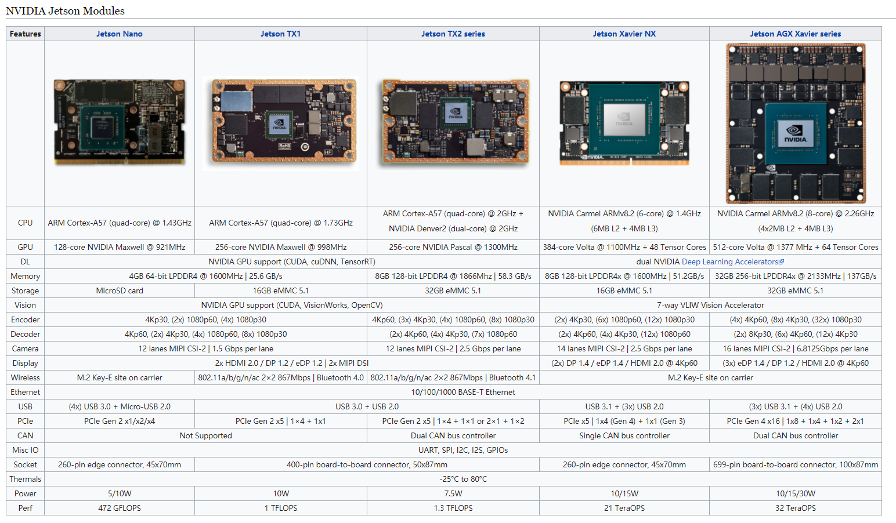
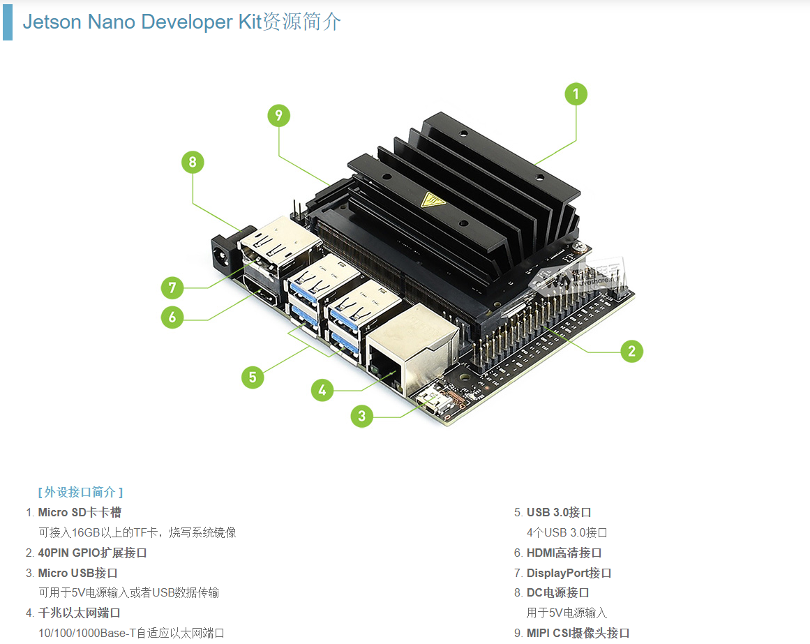
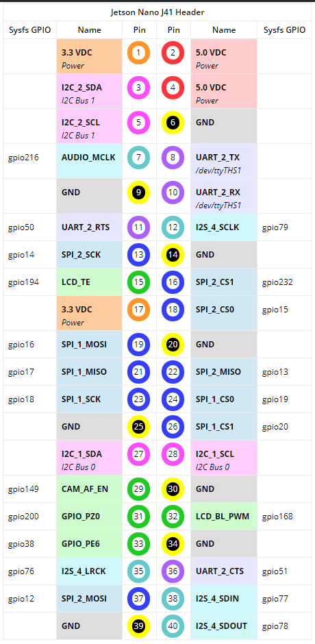
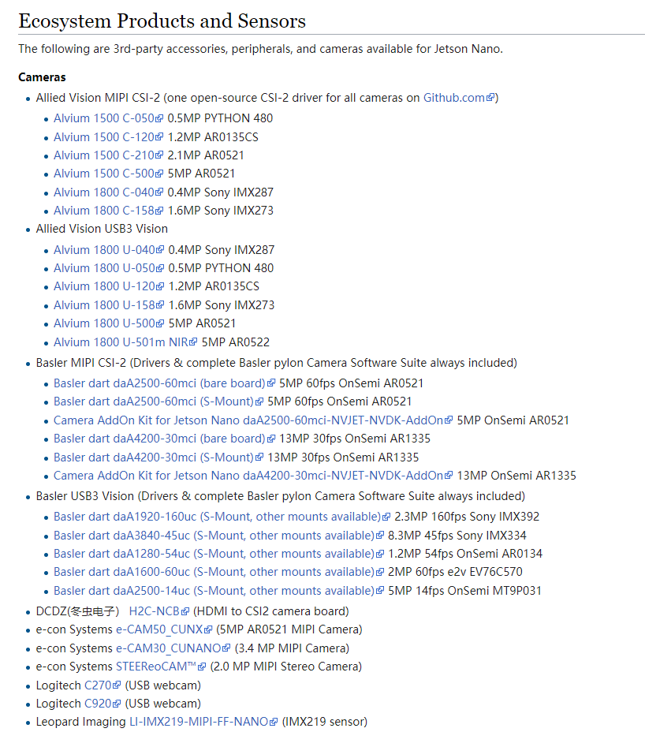
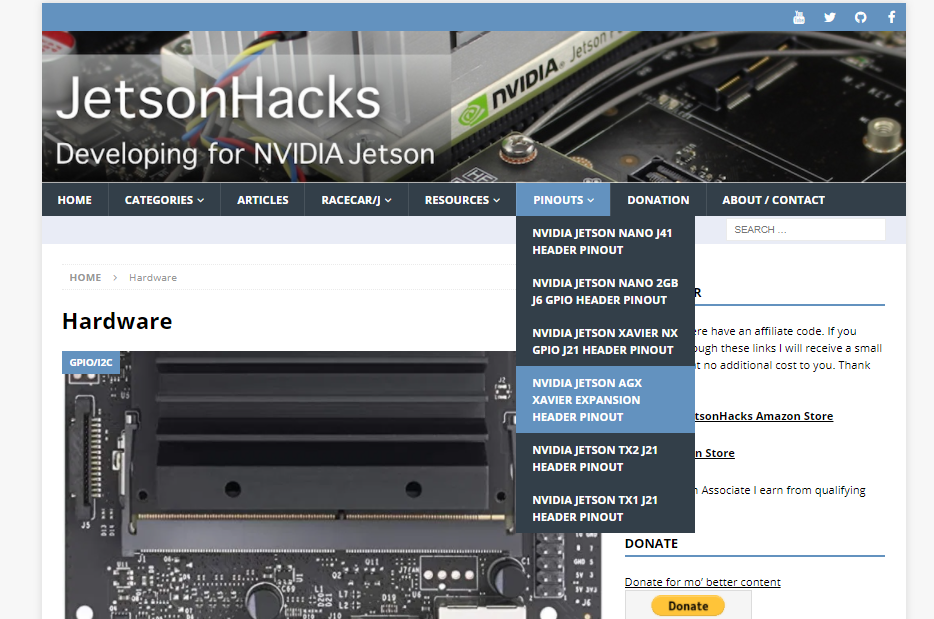

> [Jetson Xavier中文用户指南](./Jetson Xavier中文用户指南.pdf) 

# Nvidia Jetson Modules

- https://developer.nvidia.com/embedded/learn/getting-started-jetson getting start

# 开发板介绍

## 推荐视频

- [微雪电子 Jetson Nano Developer Kit](https://www.bilibili.com/video/av73932857?zw)   
  - Jetson Nano Developer Kit 是一款体积小巧当功能强大的`AI开发套件`，搭载四核Cortex-A57处理器，128核Maxwell GPU 以及4GB LPDDR内存。支持NVIDIA JetPack。可以并行运行多个神经网络对图像分类，目标检测，分割和语音处理等应用。 
  - 
  - 产品[链接](http://www.waveshare.net/shop/Jetson-Nano-Developer-Kit.htm) 
- [Jetson Nano Developer Kit 是一款体积小巧当功能强大的AI开发套件](http://www.waveshare.net/wiki/Jetson_Nano_Developer_Kit)  

## PIN GPIO扩展接口

- [NVIDIA Jetson Nano J41 Header Pinout](https://www.jetsonhacks.com/nvidia-jetson-nano-j41-header-pinout/)   
- 

## 支持的外置设备

- [Jetson所有产品所支持的设备](https://elinux.org/Jetson) 

  - [nano所支持的相机 ](https://elinux.org/Jetson_Nano#Cameras) 
    - 

  - [nano所支持的无线网卡](https://item.m.jd.com/product/70359672767.html?wxa_abtest=o&utm_source=iosapp&utm_medium=appshare&utm_campaign=t_335139774&utm_term=Wxfriends&ad_od=share&gx=RnEyxzZQYTLby9TALzuhzGcFd-E) 
  - [Jetson Network Adapters](https://elinux.org/Jetson/Network_Adapters) 

## 硬件相关官网

- [Hardware](https://jetsonhacks.com/category/hardware/) 
- 

