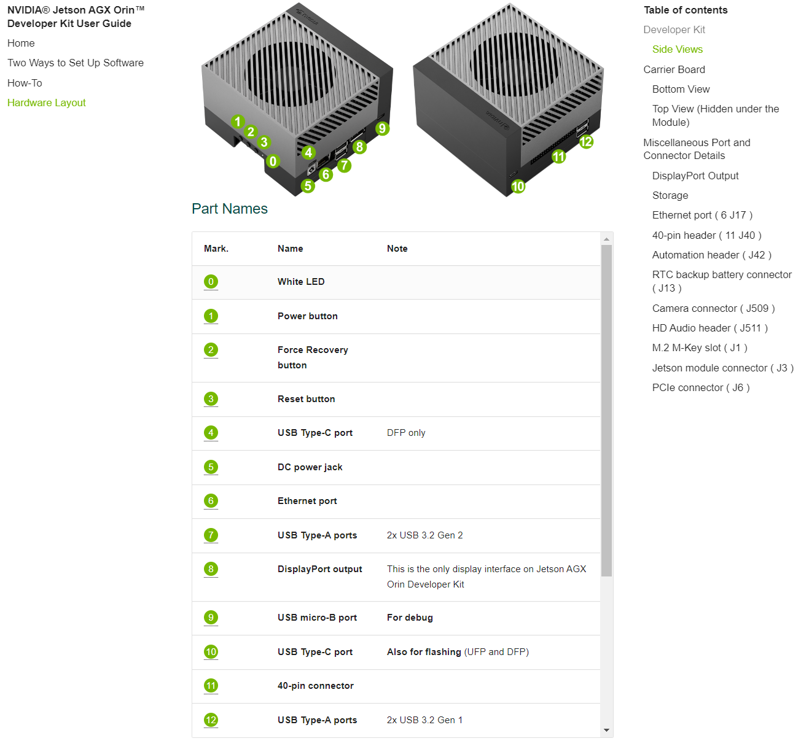
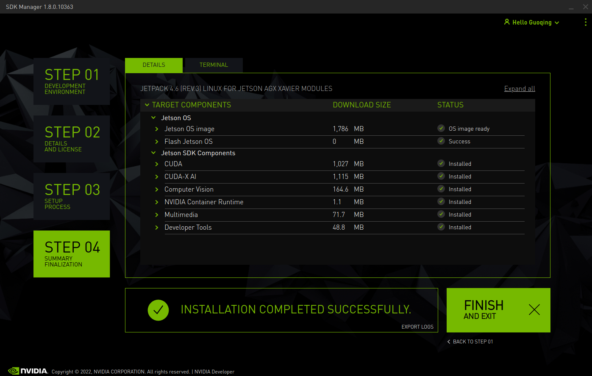

# Jetson AGX Xavier刷机前提

- 在刷机之前，需要准备`一台装有Ubuntu系统的宿主电脑`。将 Xavier 连接电源，先不开机，通过自带的一根`Type-C转USB转数据线`，将Xavier与宿主电脑连接起来即可

- 宿主电脑需要联网，且网络稳定，这对于刷机也很重要。`Jetson Xavier `设备可提前连上显示器，方便刷机过程中查看状态

- 在刷机之前，需要选择合适的系统镜像版本，本文选择安装`JetPack4.6`版本

# Ubuntu虚拟机安装

## 资源下载

- 下载[VMware](https://www.vmware.com/hk/products/workstation-player/workstation-player-evaluation.html)  
- 下载[Ubuntu18.04镜像](http://mirrors.aliyun.com/ubuntu-releases/18.04/)  

## 安装Ubuntu

> :red_circle: **注意点：1. 内存8G以上 2. 存储80G以上** 


- 最大磁盘分配`>100G` 


- 内存`>=8G` 


# JetPack包

- [各个版本 JetPack Archive](https://developer.nvidia.com/embedded/jetpack-archive) 
- 了解，没啥用

# Jetson AGX Xavier刷机

## 准备工作

- 在Ubuntu中安装[SDK Manager](https://developer.nvidia.com/embedded/jetpack) 

  

  - 要注册账号、验证等步骤

- 在下载路径下执行命令后，输入`Y` 

  ```shell
  sudo apt install ./sdkmanager_你看版本_amd64.deb
  ```

## 刷机

### 硬件支持

- 外接显示器，SDK Manager需要至少1440x900的分辨率

- 数据线连接电脑（USB口）与Xavier（type-c口）

- :pushpin: 启动**recovery模式** 

  - 关机状态下，先按住:black_circle: 按钮2，再按住:black_circle:按钮1，1s后松手进入recovery模式
  
    
  
  - Ubuntu终端执行`lsusb`命令，出现`NVIDIA Crop`设备则成功
  
    
  
  

## SDK manager

- Ubuntu终端执行`sdkmanager`命令打开管理器并登录

- :one: **Step1**    选择自己需要刷机的产品，正常只要设备进入了恢复模式或者开机状态，与电脑连接上便会自动选择检测到的产品，主机去掉勾选，可以不要。其它的根据需要安装，网络或是其他原因会导致很多步骤出现oops！，幸运的话可以retry成功，否则需要多次重启应用，如果有条件科学上网，那对刷机会大有助益

  - 本文使用`JetPack 4.6` 

  

- :two: **Step2**    勾选接受协议那个复选框即可，点击`continue` 

  

- :three: **Step3**    等待下载及安装

  

  - 弹出下框，选择`Manual Setup`进行安装，进行等待

    

  - 进度到`22%`左右，`Jetson`连接的屏幕出现`Nvidia`系统相关信息，安装提示进行系统安装，此时，主虚拟机上弹出相关配置，输入刚才设置的用户名、密码

    

  - 输入后，继续安装，此时安装`Jetson SDK Components`，耐心等待

    

- :four: **Step4**    等待安装直至完成

  

- 如果过程中安装有出错，可以考虑一下安装文件路径是否存在中文，最好是将安装文件保存在`home`目录下。如果多次retry都不成功，可以尝试停止本次安装，返回第一步，点击应用界面左下角的`Repair/Uinstall`，将`Jetson OS image` 卸载，然后重新安装，之前有通过这个安装成功

  

  