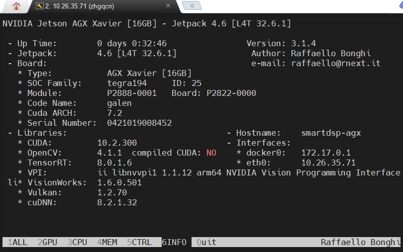
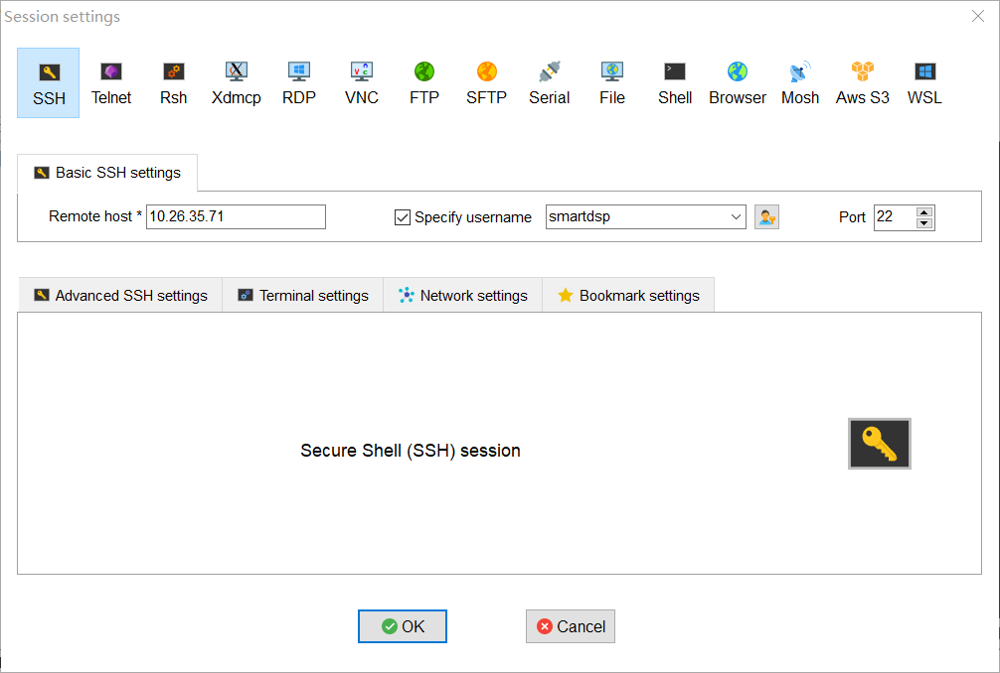
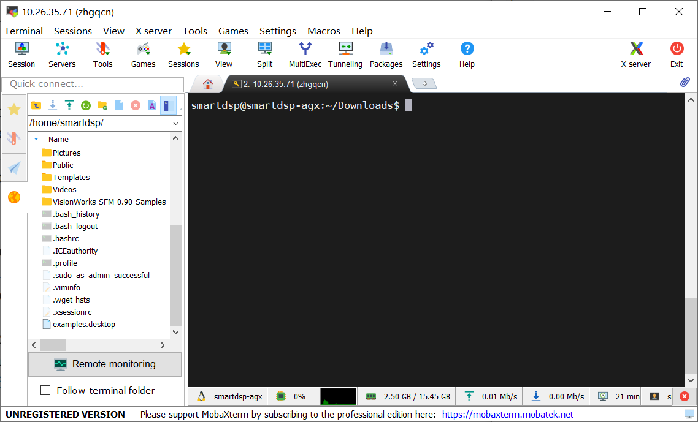

# 网络相关

## 有线网设置

- 打开`terminal `输入：`sudo vim /etc/network/interfaces`

- 在打开的文件下面加入以下内容（地址、掩码、网关根据网络情况设置）

  ```shell
  auto eth0          
  iface eth0 inet static
    address 192.168.1.170  
    netmask 255.255.0.0  
    gateway 192.168.1.1
  ```

- 配置DNS

  ```shell
  vim  /etc/resolv.conf
  # 末尾追加如下内容
  nameserver 192.168.0.10（自己的DNS服务器IP）
  ```

- 设置保存后重新激活网络服务文件：`sudo /etc/init.d/networking restart `

- 重启服务器`reboot`，输入`ifconfig`是否改动成功

## 无线网

- [`Jetson/Network Adapters`](https://elinux.org/Jetson/Network_Adapters)

  - 无线网卡[推荐](https://item.m.jd.com/product/70359672767.html?wxa_abtest=o&utm_source=iosapp&utm_medium=appshare&utm_campaign=t_335139774&utm_term=Wxfriends&ad_od=share&gx=RnEyxzZQYTLby9TALzuhzGcFd-E)   

- 推荐的网卡是免驱动直插直用的，如果没有检查到，执行下面：

  ```shell
  sudo apt-get install linux-firmware
  sudo reboot
  ```

## `VPN`配置

- 资料推荐
  - [玩转Jetson Nano（四）跑通jetson-inference](https://blog.csdn.net/beckhans/article/details/89243897?utm_medium=distribute.pc_relevant_t0.none-task-blog-BlogCommendFromMachineLearnPai2-1.channel_param&depth_1-utm_source=distribute.pc_relevant_t0.none-task-blog-BlogCommendFromMachineLearnPai2-1.channel_param)  
- 有用到再完善

# SSH配置

## 服务器端

- 安装`apt-get install openssh-server`  

- SSH配置：修改配置文件`vi /etc/ssh/sshd_config`  

  - 默认端口为`22`，取消注释行，重启服务
  - ssh默认配置是允许root登录的，可以修改配置表禁止其登录`PermitRootLogin no`

- 启动服务

  ```shell
  /etc/init.d/ssh stop           　#停止 
  /etc/init.d/ssh start            #启动
  /etc/init.d/ssh restart          #重启
  ```

- 查看SSH进程  `netstat -ta | grep ssh`  

## 客户机端

- 利用`vscode`连接，修改`.ssh/config`文件

  ```
  Host Jetson-agx
      HostName 10.26.35.71
      User zhgqcn
      Port 22
      ForwardAgent yes
  ```

# 远程连接

- 上述SSH客户端连接是没有图形界面的
- 图形界面软件
  - `TeamViewer`还行
  - `RDP`远程桌面太丑
  - `Xming`窗口太乱
  - `NoMachine` 重磅推荐:boom:

## `NoMachine`安装

> 参考：[`NoMachine`远程登录`Jetson NaNo`](https://www.codeleading.com/article/46302543639/) 

- [`Windows`端下载](https://www.nomachine.com/download)   

- [`Ubuntun`端下载](https://www.nomachine.com/download/linux&id=30&s=ARM)    
  
  - 下载`arm64`架构的[deb包](https://www.nomachine.com/download/download&id=116&s=ARM)   

    ```shell
    wget https://download.nomachine.com/download/7.9/Arm/nomachine_7.9.2_1_arm64.deb
    ```
  
  - 安装
  
    ```shell
    sudo dpkg -i nomachine_7.9.2_1_arm64.deb
    ```
  
- :disappointed_relieved: 实验室中`WiFi`和有线网不是局域网，`Nomachine`无法直接用
  - 可以在实验室接个路由器...
  - 都有一个网络

### 常用命令

- 状态查看

  ```shell
  /usr/NX/bin/nxserver --status
  ```

- 检查端口是否开启

  ```shell
  sudo netstat -lanput |grep 4000
  ```

- 重启服务

  ```shell
  /usr/NX/bin/nxserver --restart
  ```

# `jtop`

>  我们在使用`jetson`设备时，该如何实时查看`CPU`，`GPU`，`Memory`等硬件设备使用情况，风扇开启以及每次想要更改风扇的转数又该如何。为了解决上述问题，推荐称为`jtop`的软件

## 安装

- `jtop` 官网**[jetson_stats](https://github.com/rbonghi/jetson_stats)** 

- 🚀 执行命令安装

  ```shell
  sudo -H pip install -U jetson-stats
  ```

- 就这么简单！然后`reboot`一下

## 使用

- 在命令行输入`jtop`就行啦，之后便可以方便查看各种信息

  

#  `MobaXterm`

> `SSH`连接工具及`SFTP`文件传输

- [MobaXterm下载](https://mobaxterm.mobatek.net/)

- SSH配置

  

- 在文件夹区域直接拖拽下载和上传文件

  

