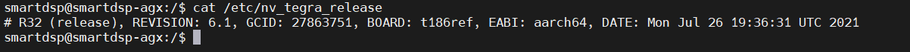

# 查看架构

```shell
$ sudo dpkg  --print-architecture
```

- `Jetson AGX Xavier`是`arm64`位的

# 查看系统版本

```shell
$ cat /etc/nv_tegra_release
```



- 通过`jtop`看简单些

# 查看CUDA版本

```shell
$ cat /usr/local/cuda/version.txt
```

#  查看当前工作模式

```shell
$ sudo nvpmodel --query
```

# 设置当前模式

```shell
$ sudo nvpmodel -m 0
```

# 开启风扇，开启最大时钟

```shell
$ jetson_clocks
```


# 查看clock工作状态

```shell
$ jetson_clocks --show
```

# 查看CPU温度

```shell
$ sudo apt install lm-sensors
$ sensors
```

# 显示当前目录

```shell
$ pwd
```

# 查看系统环境变量
```shell
$ env
```

# 查看CPU几核

```shell
$ nproc
```

这个命令非常有用，在编译时可以加速编译时间

# 查看设备树

```shell
$ /sys/firmware/fdt
$ /sys/firmware/devicetree
$ /proc/device-tree
```


这几个目录下可以查看当前系统的设备情况

# 列出安装得所有应用

```shell
$ dpkg --list
```

# 清理安装失败的rc应用

```shell
$ sudo apt-get purge $(dpkg -l|grep ^rc|awk ‘(print $2)’)
```

# 卸载指定的包

```shell
$ sudo apt-get --purge remove 包名
```

# 清理不完整的软件包

```shell
$ sudo apt autoclean
```

# 清理apt缓存内容

```shell
$ sudo apt-get clean
```

# 清理任何未用的依赖项

```shell
$ sudo apt autoremove
```

# 使用autoremove命令卸载

```shell
$ sudo apt autoremove application-name
```

