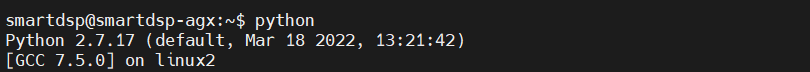
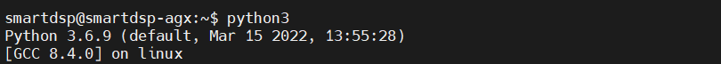
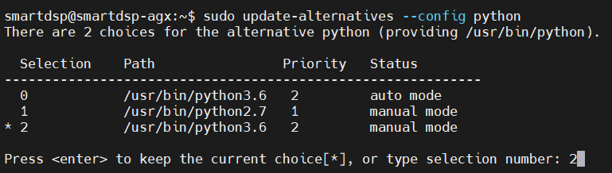
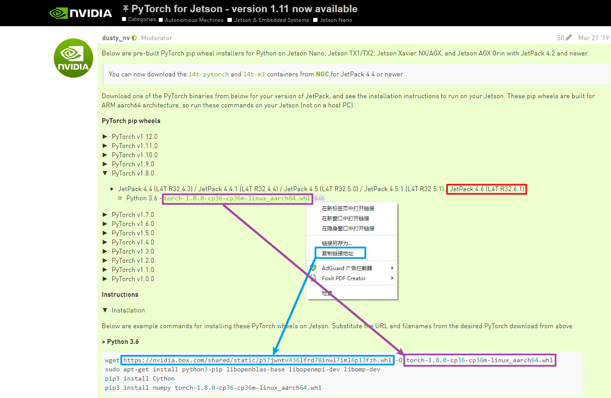
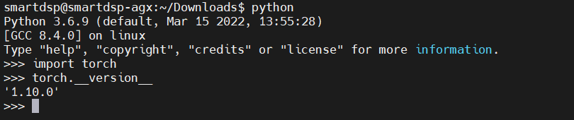
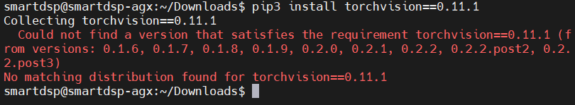
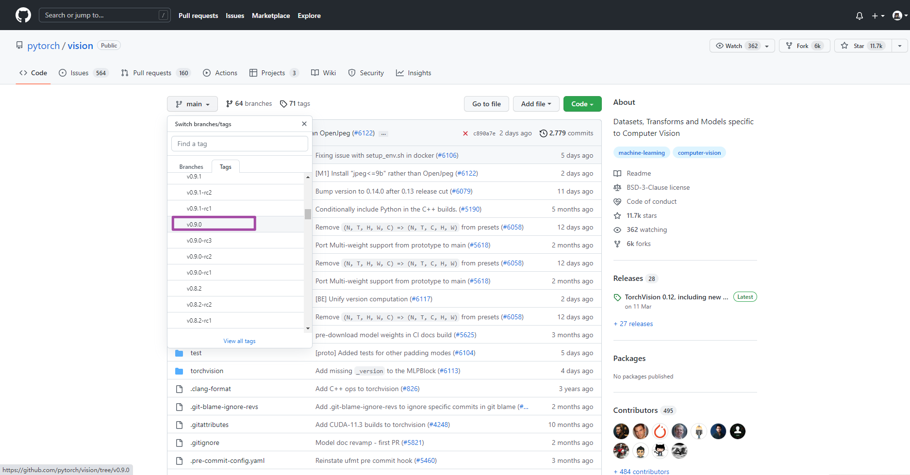
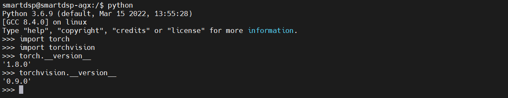
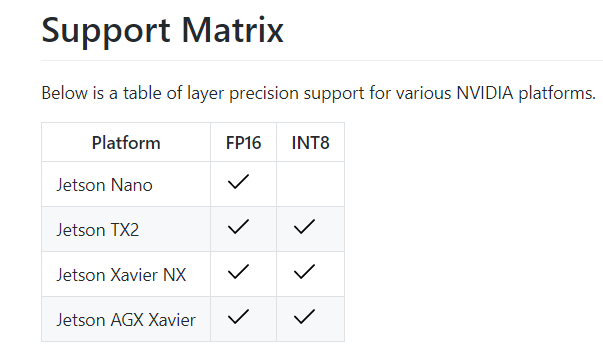

# 已有环境

- 通过`jtop`可以看到，`Cuda`、`Opencv`、`TensorRT`、`CuDNN`等已经装好

- 接下来安装 `python` `pytorch` 及 `torchvision` 

  

# `Python`切换

> 开发环境需要`3.6.x` 

- 默认`python=2.7`  

  

- `Ubuntu18.04`内置`python==3.6.x`   

  ```shell
  $ sudo apt update
  $ sudo apt upgrade
  $ python3 -v
  ```



## 版本切换

- 详解[`alternatives`](https://zskjohn.blog.csdn.net/article/details/115261860?spm=1001.2101.3001.6661.1&utm_medium=distribute.pc_relevant_t0.none-task-blog-2%7Edefault%7ECTRLIST%7ERate-1-115261860-blog-119971579.pc_relevant_antiscanv2&depth_1-utm_source=distribute.pc_relevant_t0.none-task-blog-2%7Edefault%7ECTRLIST%7ERate-1-115261860-blog-119971579.pc_relevant_antiscanv2&utm_relevant_index=1)命令学习

- 加入`alternatives`进行版本管理

  ```shell
  $ sudo update-alternatives --install /usr/bin/python python /usr/bin/python2.7 1
  $ sudo update-alternatives --install /usr/bin/python python /usr/bin/python3.6 2
  ```

- 版本切换

  ```shell
  $ sudo update-alternatives --config python
  ```

  

## 安装`pip3`

- 安装

  ```shell
  $ sudo apt install python3-pip
  ```

- 查看是否成功

  ```shell
  $ pip list
  ```

# `Pytorch`安装

- `Jetpack`版本和`Python`版本也要对应，目前是`Jetpack==4.6`，`Python==3.6.9` 

- `Pytorch`与`Jetpack`版本对应:notebook:[查询](https://forums.developer.nvidia.com/t/pytorch-for-jetson-version-1-11-now-available/72048)  

  

- 安装命令

  ```shell
  # 下载包
  $ wget https://nvidia.box.com/shared/static/p57jwntv436lfrd78inwl7iml6p13fzh.whl -O torch-1.8.0-cp36-cp36m-linux_aarch64.whl
  # 安装依赖
  $ sudo apt-get install python3-pip libopenblas-base libopenmpi-dev libomp-dev
  # 安装Cpython
  $ pip3 install Cython
  # 安装包
  $ pip3 install numpy torch-1.8.0-cp36-cp36m-linux_aarch64.whl
  ```

  - :boom: `Jetson`要是没有`VPN`用`wget`下载不下来，可以用有`VPN`的下载后上传

- 测试是否成功安装

  

# `torchvision`安装

- `torch`与`torchvision`版本[对应关系](https://github.com/pytorch/vision/blob/main/README.rst)  
  - `torch==1.8.0`匹配`torchvision==0.9.0`

## `pip`安装命令

```shell
# 安装依赖
$ sudo apt-get install libjpeg-dev zlib1g-dev libpython3-dev libavcodec-dev libavformat-dev libswscale-dev
# pip安装
$ pip3 install torchvision==0.9.0
```

- :boom: `pip3 install`不成功，在[pypi](https://pypi.org/project/torchvision/0.11.1/中也)找不到对应的包

  

- :x: 对于`torchvision==0.11.1`不推荐用这个方法

## `github`编译安装

- 了解`gitclone`中`tag`和`branch`的[下载方法](https://www.haiyun.me/archives/1284.html)  

- 安装

  
  
  ```shell
  # 安装依赖
  $ sudo apt-get install libjpeg-dev zlib1g-dev libpython3-dev libavcodec-dev libavformat-dev libswscale-dev
  # 下载仓库
  $ git clone --branch v0.9.0 https://github.com/pytorch/vision torchvision   # see below for version of torchvision to download
  $ cd torchvision
  $ export BUILD_VERSION=0.9.0  # where 0.x.0 is the torchvision version  
  $ python3 setup.py install --user
  $ cd ../  # attempting to load torchvision from build dir will result in import error
  $ pip install 'pillow<7' # always needed for Python 2.7, not needed torchvision v0.5.0+ with Python 3.6
  ```

- 大功告成

  

# ` torch2rt`安装

- [官方文档](https://docs.nvidia.com/deeplearning/tensorrt/developer-guide/index.html#python_topics)  

- [`github仓库`](https://github.com/NVIDIA-AI-IOT/torch2trt)  

- 精度转换支持

  

  

## 安装

```shell
$ git clone https://github.com/NVIDIA-AI-IOT/torch2trt
$ cd torch2trt
$ sudo python setup.py install
```

