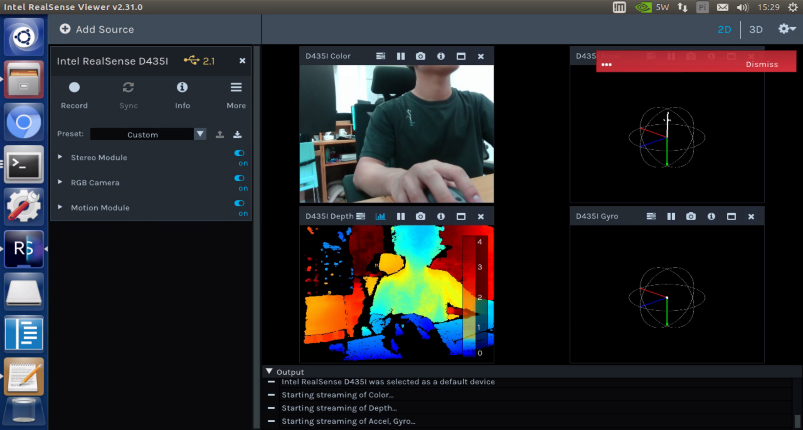

# 摄像头

> 摄像头为`Intel RealSense D435i` 



## 调试`SDK`安装

```shell
$ git clone https://github.com/jetsonhacksnano/installLibrealsense
$ cd installLibrealsense
$ ./buildLibrealsense.sh
$ ./installLibrealsense.sh -c
$ ./patchUbuntu.sh
```

## 运行

```shell
$ relsense-viewer
```

## 问题

### `Cuda`版本

- build文件中默认`cuda`是**10.0**，要改成**10.2**  

- build成功输出

```shell
The library is installed in /usr/local/lib
The header files are in /usr/local/include
The demos and tools are located in /usr/local/bin
```

### 接线问题

-  数据线两头都是`Type-C`的，但是正反面有区别，接错了显示的是`USB 2.1`，正确为`USB 3.0` 

> **参考：**https://www.jetsonhacks.com/2019/05/16/jetson-nano-realsense-depth-camera/

## Python代码调用摄像头

### `pyrealsense2`安装

- 下载包，网址为[Click](https://pypi.org/project/pyrealsense2-aarch64/#files)，可以用下面命令直接下载

```shell
$ wget https://files.pythonhosted.org/packages/a6/5a/50da81df5dc01fcc38a48a3d0e3246421ede19b52a1a7a763ef496603482/pyrealsense2_aarch64-2.23.0-cp36-none-any.whl
```

- 到下载路径下安装

```shell
$ pip3 install pyrealsense2_aarch64-2.23.0-cp36-none-any.whl 
```

### 测试一下

- 在有图形界面下进行

```python
import time
import numpy as np
import pyrealsense2 as rs
import cv2

framerate = 30
pipeline = rs.pipeline()
config = rs.config()
# 640x480 | 1280x720 | ...
config.enable_stream(rs.stream.color, 1280, 720, rs.format.bgr8, framerate)
pipe_profile = pipeline.start(config)
save_path = "./images_jpg/"
shot_flag = False
while True:
    frames = pipeline.wait_for_frames()
    color_frame = frames.get_color_frame()
    img_color = np.asanyarray(color_frame.get_data())
    cv2.imshow("CAMERA_D435I", img_color)

    key = cv2.waitKey(1)
    if key & 0xFF == ord('q'):
        break
    elif key & 0xFF == ord('s'):
        shot_flag = ~shot_flag
        print("shot flag "+ str(shot_flag))
    if shot_flag:
        cv2.imwrite(save_path + str(time.time()) + ".jpg", img_color)
        shot_flag = False
```

