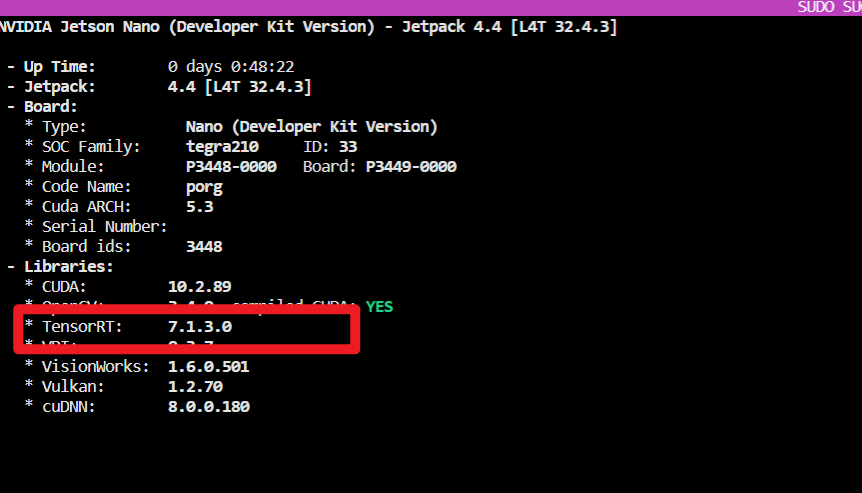
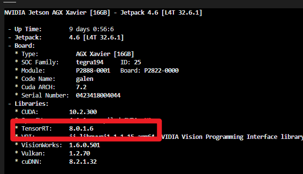
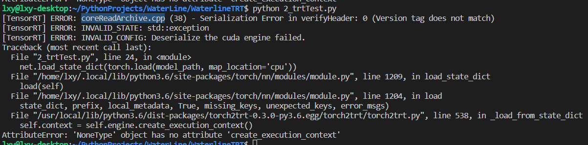
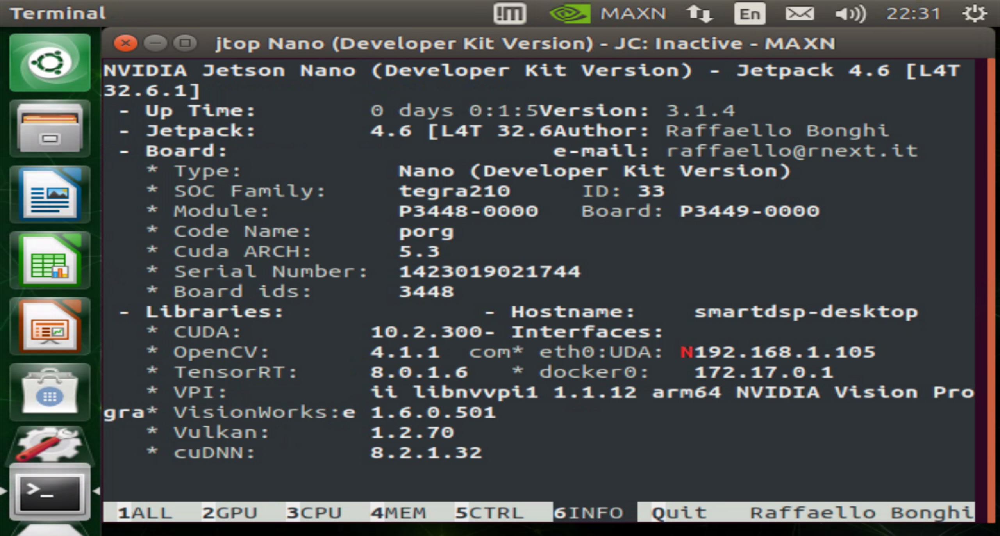
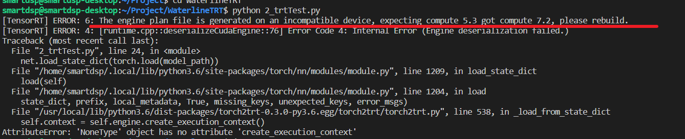
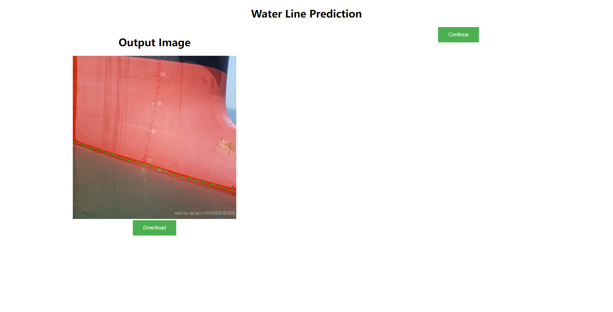
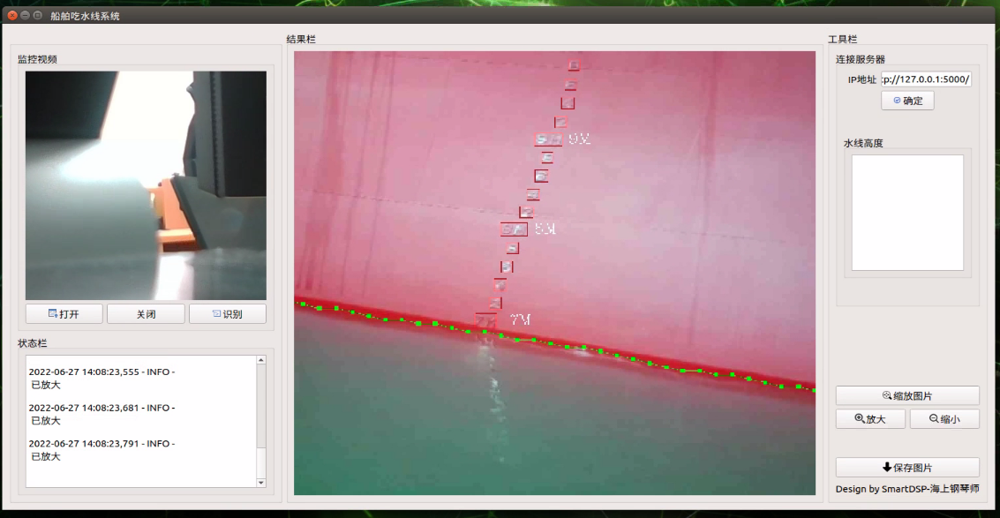
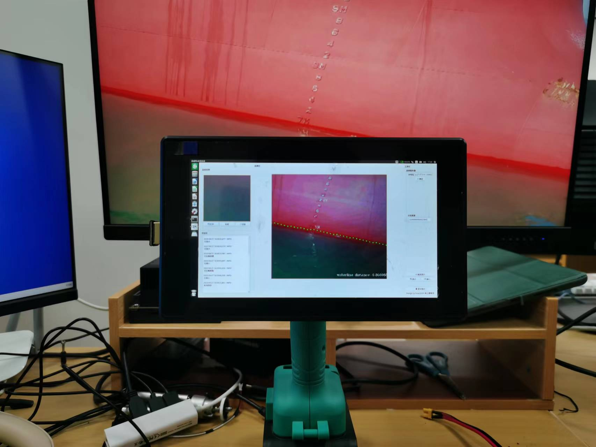

# `Torch2TRT`中的坑

## 环境一致性

- 一开始 `Jetson Nano` 中的环境

- `Jetson AGX` 的环境

  

- 由于环境不一致，出现了`NoneType`错误

  

- 好吧，重新[升级](https://blog.csdn.net/weixin_50008473/article/details/119606822)`Jetson Nano`或者[重刷](./第2章-虚拟机及刷机.md)吧，建议直接重刷remake

  - 重刷要让`Nano`进入`recovery`模式，按住`rec`键再按住`res`键2秒后释放，连接`micro-usb`到虚拟机‘

  

  

- 这下环境是可以了吧，but，又遇到下面问题了 😓  
  - `AGX`算力是7.2
  - `Nano`算力是5.3
  - 这是硬件特性决定的的

## 转`ONNX` 

- `torch2trt`转不成，换个思路转`onnx`，虽然计算慢一些，但是先能用再优化吧

# 前后端

### 后端

- 基于`Flask`写了后端
- 后端向前端提供接口，所以这个界面不重要

### 前端

- 基于`pyqt5`完成前端

  

### 总体

# 总体感受

- 虽然工作都是❤煜哥❤先前完成的，有现成的算法和硬件以及教程，但是把他们串起来还是麻烦的
- 第一次接受`Jetson`，从刷机到使用遇到各种麻烦事，总结了该文档📚 

